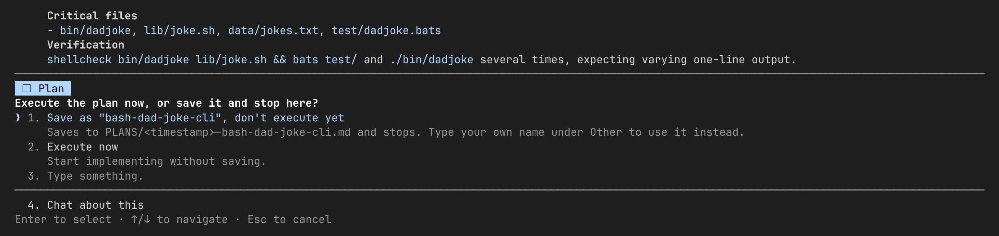
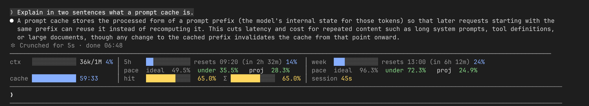
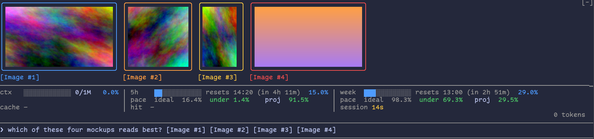

# maharianto-claude-plugins

A [Claude Code](https://claude.com/claude-code) plugin marketplace by Aridya Maharianto.

| Plugin | What it does |
|---|---|
| [`save-plan`](save-plan/README.md) | Saves plan-mode plans to `PLANS/<yyyymmdd-HHMMss>-<name>.md`, on approval or by typing a save request under "No, keep planning". |
| [`token-visualizer`](token-visualizer/README.md) | Draws a band above the prompt with the context window, 5h and weekly usage, pace, cache TTL and hit rate. |
| [`paste-peek`](paste-peek/README.md) | Draws tiles above the prompt for each pasted image, long text and file path in the draft. |
| [`wordsmith`](wordsmith/README.md) | Turns a rough prompt into a structured one, asking about every gap instead of assuming, and puts it in the input box unsent. |

`save-plan` asks whether to save or execute once you approve a plan:



`token-visualizer` shows the band above the prompt:



`paste-peek` shows a tile for each pasted image, long text and file path above the prompt:



## Install

Add the marketplace, then install the plugins you want:

```
/plugin marketplace add maharianto-dev/claude-plugins
/plugin install save-plan@maharianto-claude-plugins
/plugin install token-visualizer@maharianto-claude-plugins
/plugin install paste-peek@maharianto-claude-plugins
/plugin install wordsmith@maharianto-claude-plugins
```

To try one from a local checkout without installing it:

```bash
claude --plugin-dir ./token-visualizer
```

All plugins include a mod (function hooks), so they need a Claude Code build that supports mods. `save-plan` also needs `bash` and `jq`.

## Development

Run these from the repo root, with `<plugin>` being `save-plan`, `token-visualizer`, `paste-peek` or `wordsmith`:

```bash
claude plugin validate <plugin>        # manifest and hooks module check
claude plugin test <plugin>            # runs <plugin>/hooks/*.test.ts against the engine
bunx -p typescript tsc -p <plugin>     # type-check a mod
```

A plugin's version lives in two places: its `.claude-plugin/plugin.json` and its entry in `.claude-plugin/marketplace.json`. Bump both together. [CLAUDE.md](CLAUDE.md) has the architecture notes and the manual end-to-end procedure.

## License

[GPL-2.0](LICENSE)
